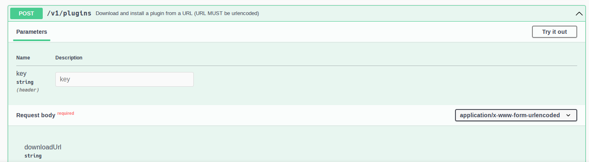



Image belongs to https://mystickermania.com/sticker-packs/minecraft/minecraft-guardian

# ×| NANA |×

A Discord Bot for Easy SMP. Made 2 years ago, has some chaotic code for sure.

## Acknowledgements

This project uses the Sentry BGC command handling approach. Thus, it may have some dead code. Not to mention, a lot of promises in `commands/history.js`.

## Demo

https://github.com/BrycensRanch/Nana/assets/117921904/6b8842db-0291-4545-999b-7a08c578da2c

## How do I run this myself?

Firstly, you will need experience with NodeJS and Minecraft Servers. There's a lot of dependencies NANA relies on and while it's fairly easy to add them, the possible implications while having no idea what you're doing are MASSIVE.

### For example, ServerTap introduces this very dangeorus possibility

The best way to mitigate this would be to disable ALL the endpoints NANA does not use.

### This bot uses SFTP to connect to a server it assumes to be remote.

God forbid something goes horribly wrong, it could lead to a compromised server. I recommend creating a user with hardly any permissions besides what it needs. The use of SSH key authentication is highly recommended.

Ideally, the server should only be able to be accessed from a VPN like Tailscale as a Docker Container. You will have to do the work of dockerizing this Discord bot. https://hub.docker.com/r/tailscale/tailscale

Best of luck, as you'll likely need to modify some lines of code. https://github.com/theophilusx/ssh2-sftp-client
